# Aleq System Architecture

**Version:** 1.0
**Date:** December 2024
**Status:** Reference Document

---

## Executive Summary

Aleq is a **25-year-old finance hire** - not a chatbot, not a workflow system. This document describes how Aleq works from both technical and user perspectives.

| Capability | System | Function |
|------------|--------|----------|
| **Face** | Lemons Frontend | Widgets, timeline, decisions - shows work transparently |
| **Brain** | Baby MARS | Cognitive loop, beliefs, autonomy modes |
| **Hands** | Stargate | 340+ capabilities including research (Curiosity) across 27 platforms |
| **Memory** | ERP Next via Lyra | Source of truth for financial data |

---

# Part 1: Technical Integration

## 1.1 System Architecture


## 1.2 API Contract Summary

### Endpoints (from `/docs/API_CONTRACT_V0.md`)

| Endpoint | Method | Purpose |
|----------|--------|---------|
| `/chat` | POST | Send message, get streaming response |
| `/chat/interrupt` | POST | Interrupt current stream |
| `/tasks` | GET | List tasks (filterable by status) |
| `/tasks/{id}` | GET | Full task detail with timeline |
| `/decisions/{id}` | GET | Decision detail |
| `/decisions/{id}/execute` | POST | Execute decision (idempotent) |
| `/decisions/{id}/undo` | POST | Undo (if within 30s window) |
| `/beliefs/{id}` | GET | Belief detail with history |
| `/beliefs/{id}/challenge` | POST | Dispute a belief |
| `/data/{widget}` | GET | Widget data |
| `/data/{widget}/{drill_path}` | GET | Drill-down data |
| `/events` | GET (SSE) | Real-time event stream |

### Event Types (SSE)

| Event | When | Payload |
|-------|------|---------|
| `task:created` | New task | `{task_id, type, summary}` |
| `task:updated` | Status change | `{task_id, status, summary}` |
| `task:decision_needed` | Decision surfaced | `{task_id, decision_id, summary}` |
| `decision:made` | Someone decided | `{decision_id, made_by, action}` |
| `data:changed` | Widget needs refresh | `{widget_id, change_type}` |
| `aleq:message` | Proactive communication | `{message, references}` |

### Data Freshness Tiers

| Tier | Widgets | Refresh Rate |
|------|---------|--------------|
| **Tier 1 (Critical)** | Cash, Bank | Real-time when focused, 30s when visible |
| **Tier 2 (Important)** | AR, AP, Revenue | 5-minute cache, refresh on click |
| **Tier 3 (Computed)** | Runway, Ratios | Hourly recomputation |

## 1.3 Data Flow Sequences

### A. Direct UI Flow (No MARS)

User clicks widget, exports data, filters views - no cognitive processing needed.


### B. Aleq Query Flow (MARS Interprets)

User asks a question - MARS interprets intent, fetches data, responds.


### C. Aleq Action Flow (Full Cognitive Loop)

User requests an action - full cognitive loop with autonomy checks.


## 1.4 State Management

### Frontend (Lemons - Zustand)

```typescript
// Context Pills Store
interface ContextPill {
  id: string
  label: string
  type: 'transaction' | 'person' | 'account' | 'invoice' |
        'metric' | 'insight' | 'step' | 'belief' |
        'detail' | 'correction' | 'payment' | 'customer' | 'expense'
  data?: Record<string, unknown>
}

// Mode Context
type ViewMode = 'aleq' | 'books'

// Widget Drill State
type WidgetDepth = 0 | 1 | 2 | 3
interface DrillDownState {
  currentDepth: WidgetDepth
  path: { id: string, label: string, depth: WidgetDepth }[]
  activeItemId: string | null
}
```

### Backend (MARS - BabyMARSState)

```python
# From src/state/schema.py
class BabyMARSState(TypedDict):
    # Core
    thread_id: str
    org_id: str
    current_message: str

    # Cognitive State
    appraisal: AppraisalResult
    supervision_mode: str  # guidance_seeking | action_proposal | autonomous
    belief_strength_for_action: float

    # Actions
    proposed_action: ActionProposal
    execution_results: list[ExecutionResult]

    # Memory
    activated_beliefs: list[BeliefState]
    memories: list[Memory]

    # Response
    final_response: str
```

---

# Part 2: User Journey

## 2.1 Interface Layout

```
┌─────────────────────────────────────────────────────────────────┐
│  HEADER: [Aleq Logo]     [Aleq | Books]           [FC Avatar]   │
├─────────────────────────────────────────────────────────────────┤
│  NAVBAR: TASKS [●○○]                    VIEWS [●●○]             │
├──────────────────────────────────────────┬──────────────────────┤
│                                          │                      │
│  ┌─────────┐  ┌─────────┐  ┌─────────┐  │   TASK PANEL         │
│  │  CASH   │  │   AR    │  │ RUNWAY  │  │   (Timeline)         │
│  │ $1.247M │  │  $284K  │  │ 18.2mo  │  │                      │
│  │ +$84K ▲ │  │ -$38K ▼ │  │ $68K/mo │  │   9:31:04            │
│  └─────────┘  └─────────┘  └─────────┘  │   ● Received PDFs    │
│                                          │                      │
│  ┌─────────┐  ┌─────────┐               │   9:31:47            │
│  │ REVENUE │  │EXPENSES │               │   ● Extracted 47     │
│  │  $89K   │  │  $68K   │               │     payments         │
│  └─────────┘  └─────────┘               │                      │
│                                          │   [Reasoning block]  │
│  CANVAS (3-column grid)                  │   [Decision card]    │
│                                          │                      │
├──────────────────────────────────────────┴──────────────────────┤
│  TERMINAL                                                        │
│  › @Acme Corp @INV-1247 │ Ask Aleq anything...          [→] [🔒]│
└─────────────────────────────────────────────────────────────────┘
```

## 2.2 What Users See: Lockbox Processing

**Step 1: Task Appears**
- Orange dot pulses in TASKS section of NavBar
- Hover shows: "Oct 1 Lockbox Processing - Decision Needed"

**Step 2: Click to Open Task Panel**
- Panel slides in from right
- Header: "Oct 1 Lockbox Processing"
- Stats: PAYMENTS: 47 | TOTAL: $73,924 | OCR: 94% | EXCEPTIONS: 1

**Step 3: Timeline Populates**
```
9:31:04  ● Received 6 lockbox PDFs from First Republic    [0.2s]

9:31:47  ● Extracted 47 payments from PDFs               [43.2s]
         ▼ [Expand to see reasoning]

         ┌─────────────────────────────────────────────┐
         │ REASONING                                    │
         │ Detected batch from First Republic Bank.     │
         │ Applied OCR with 94% avg confidence.         │
         │                                              │
         │ Beliefs: Lockbox Config #B-1201             │
         │ Data: First Republic Bank                    │
         └─────────────────────────────────────────────┘

         Raw Extractions: 47  |  Confidence: 94%  |  Low: 3

9:32:15  ● Matched 47 customers to records              [28.1s]
         Corrections: SeaBreeze → SB Yacht Club LLC

9:32:44  ● Matched 46 of 47 invoices                    [29.3s]

9:33:02  ○ DECISION NEEDED                              [waiting]
         ┌─────────────────────────────────────────────┐
         │ ⚠ Marina del Rey Storage LLC sent $875 for  │
         │   invoice DW-2025-0856, but that invoice    │
         │   belongs to Marina del Rey Services LLC.   │
         │                                              │
         │   [Apply to Services] [Hold] [Handle in Books]│
         └─────────────────────────────────────────────┘
```

**Step 4: User Decides**
- Clicks "Apply to Services invoice"
- Decision card updates: "Decided by you - 9:33:47"
- Timeline continues:

```
9:33:47  ● Applied payment to Marina del Rey Services   [1.2s]
         Stargate: Recurly payment.apply

9:33:49  ● Created journal entry JE-2025-4001          [2.1s]
         Stargate: NetSuite journal.create

9:33:52  ● Updated entity relationship belief          [0.3s]
         #B-8821: "MdR Storage pays for MdR Services"
         Strength: 0.70 (learned from outcome)

9:33:52  ✓ Task Complete                               [Total: 2m 48s]
```

## 2.3 Timeline Anatomy

Each timeline entry contains:

| Element | Purpose |
|---------|---------|
| **Timestamp** | When the action occurred (9:31:04) |
| **Status Dot** | ● complete, ◐ active, ○ pending, ⚠ decision |
| **Action** | What happened ("Extracted 47 payments") |
| **Duration** | How long it took (43.2s) |
| **Expand Arrow** | Click to see reasoning |

**Expanded Reasoning Block:**
- **Summary**: Plain language explanation
- **Belief refs**: Clickable links to beliefs (#B-1201)
- **Data refs**: Sources cited
- **Confidence**: Certainty level

**Drill-Down Links:**
- "View 6 lockbox PDFs" → PDF list with confidence
- "View 47 customers" → Customer match details
- "View 46 invoices" → Invoice match status

## 2.4 Context Pills

Context pills are @references that persist across queries.

**Adding Pills:**
1. Drill into widget → "Add to Context" button on any detail
2. Click entity in timeline → "+" button
3. Type @mention in terminal → autocomplete

**Types (12):**
```
@transaction  @person     @account    @invoice
@metric       @insight    @step       @belief
@detail       @correction @payment    @customer
```

**How Pills Influence Responses:**
```
Terminal: @Acme Corp @INV-1247 "What's the status?"

Aleq: "Acme Corp's invoice INV-1247 for $24,800 is 72 days
overdue. Based on their payment history (Belief #B-4401),
they typically pay within 45 days after a reminder.
Should I send a follow-up?"
```

## 2.5 Widget Highlighting

When Aleq mentions a widget, it highlights:

| Intensity | Visual | Duration |
|-----------|--------|----------|
| **mention** | Subtle border | 2 seconds |
| **focus** | Glow effect | While relevant |
| **critical** | Pulse + glow | Until acknowledged |

**Example:**
```
User: "How's our cash?"

Aleq: "Cash is $1.247M, up $84K this week."

→ Cash widget gets focus highlight (glow effect)
→ User attention drawn to the relevant data
```

## 2.6 Decision Flow


**Soft Decisions (30s undo window):**
- Payment posting
- Invoice categorization
- Entity matching

**Hard Decisions (no undo):**
- Month-end close
- Period lock
- Irreversible actions

---

# Part 3: The Poison Dart

## Maria Santos: Lockbox Processing Scenario

This scenario proves the entire system works end-to-end.

### The Setup

- **Trigger**: Lockbox PDF arrives from First Republic Bank
- **Volume**: 6 PDFs, 47 payments, $73,924.50
- **Complexity**: OCR extraction, entity resolution, invoice matching, exception handling

### Technical Trace

```mermaid
sequenceDiagram
    participant Bank as First Republic
    participant Email as Gmail Webhook
    participant MARS as Baby MARS
    participant OCR as OCR Service
    participant ER as Entity Resolution
    participant SG as Stargate
    participant Rec as Recurly
    participant NS as NetSuite
    participant UI as Frontend

    Bank->>Email: Send lockbox PDF
    Email->>MARS: Webhook trigger

    Note over MARS: Task Created
    MARS->>UI: SSE: task:created
    UI->>UI: Orange dot appears

    Note over MARS: PDF Processing
    MARS->>OCR: Extract text from 6 PDFs
    OCR-->>MARS: Raw extractions (94% confidence)
    MARS->>UI: SSE: task:updated (stage: extracted)

    Note over MARS: Entity Resolution
    MARS->>ER: Match 47 customer names
    ER->>ER: "SeaBreeze" → "SB Yacht Club LLC"
    ER-->>MARS: 47 matched, 12 with variations
    MARS->>UI: SSE: task:updated (stage: matched)

    Note over MARS: Invoice Matching
    MARS->>SG: Query Recurly for open invoices
    SG->>Rec: invoice.list_outstanding
    Rec-->>SG: 46 matches, 1 exception
    SG-->>MARS: Match results

    Note over MARS: Exception Detected
    MARS->>MARS: MdR Storage → MdR Services mismatch
    MARS->>MARS: Check autonomy: 0.35 (guidance_seeking)
    MARS->>UI: SSE: task:decision_needed
    UI->>UI: Decision card appears

    Note over UI: User Decides
    UI->>MARS: POST /decisions/{id}/execute

    Note over MARS: Execution
    MARS->>SG: Apply payment to Services invoice
    SG->>Rec: payment.apply
    Rec-->>SG: Success

    MARS->>SG: Create journal entry
    SG->>NS: journal.create (JE-2025-4001)
    NS-->>SG: Success

    Note over MARS: Learning
    MARS->>MARS: Update belief #B-8821
    MARS->>MARS: "MdR Storage pays for MdR Services"
    MARS->>MARS: Strength: 0.70

    MARS->>UI: SSE: task:updated (stage: complete)
    UI->>UI: Green checkmark, timeline complete
```



### User Journey Trace

| Time | What User Sees | What's Happening |
|------|----------------|------------------|
| 9:31 | Orange dot pulses in NavBar | Task created from email webhook |
| 9:31 | Click → Task panel opens | Loading task details |
| 9:31 | "Received 6 PDFs" appears | MARS acknowledged trigger |
| 9:32 | "Extracted 47 payments" with progress | OCR processing complete |
| 9:32 | Can expand to see corrections | "2,B50" → "2,850" |
| 9:32 | "Matched 47 customers" | Entity resolution complete |
| 9:32 | Can drill into name variations | SeaBreeze → SB Yacht Club |
| 9:33 | "Matched 46/47 invoices" | Invoice matching |
| 9:33 | **Decision card appears** | Exception: entity mismatch |
| 9:33 | Reads explanation, clicks "Apply" | User decides |
| 9:34 | Timeline continues to completion | Execution + learning |
| 9:34 | Green checkmark, "2m 48s" | Task complete |

### What This Proves

| System | Proven By |
|--------|-----------|
| **Webhook Triggers** | Email → Task creation |
| **OCR/Extraction** | PDF → Structured data with confidence |
| **Entity Resolution** | Name variations mapped correctly |
| **Belief System** | Learned entity relationship |
| **Autonomy Modes** | Exception triggered guidance_seeking |
| **HITL Decisions** | User approval flow works |
| **Stargate Execution** | Recurly + NetSuite actions |
| **Learning Loop** | Belief strength updated |
| **Transparency** | Every step visible in timeline |

### The Second Email Test

**True proof**: Process a second lockbox containing another MdR Storage payment.

**Expected behavior:**
1. MARS recognizes "MdR Storage pays for MdR Services" (belief strength 0.70)
2. Autonomy check: 0.70 ≥ 0.7 → **autonomous mode**
3. Auto-applies payment without asking
4. Timeline shows: "Applied based on learned relationship #B-8821"

If this works, the system has **learned** and **acts on that learning**.

---

# Appendix A: Component Reference

## Frontend (Lemons)

| File | Lines | Purpose |
|------|-------|---------|
| `TaskPanel.tsx` | 1,779 | Right-side task display |
| `DrillViews.tsx` | 1,312 | Polymorphic detail views |
| `Terminal.tsx` | 558 | Command interface |
| `TimelineEntry.tsx` | 556 | Individual timeline entries |
| `Widget.tsx` | 422 | Base widget components |
| `CashWidget.tsx` | 400+ | 4-level drill-down |
| `ARWidget.tsx` | 400+ | 4-level drill-down |

## Backend (Baby MARS)

| File | Purpose |
|------|---------|
| `src/cognitive_loop/graph.py` | LangGraph orchestration |
| `src/cognitive_loop/nodes/appraisal.py` | Situation assessment |
| `src/cognitive_loop/nodes/action_selection.py` | Choose action |
| `src/cognitive_loop/nodes/execution.py` | Execute via Stargate |
| `src/cognitive_loop/nodes/feedback.py` | Update beliefs |
| `src/graphs/belief_graph/graph.py` | Belief management |
| `src/state/schema.py` | State definitions |

## API Contract

| Document | Location |
|----------|----------|
| Full Contract | `/docs/API_CONTRACT_V0.md` |
| API Overview | `/docs/API_OVERVIEW.md` |
| Scenarios | `/docs/scenarios/` |

---

# Appendix B: Workflow Categories

## Category A: Pure UI (No MARS)

| Action | Frontend Only |
|--------|---------------|
| Export CSV | Direct download |
| Click widget | Drill-down state |
| Filter by date | Local filter |
| Rearrange dashboard | Layout state |
| Toggle chart type | Display option |

## Category B: Query (MARS Interprets)

| Query | What Happens |
|-------|--------------|
| "Show AR aging" | MARS interprets → Lyra fetches → Display |
| "What's Client X balance?" | Entity extraction → Data lookup |
| "Compare to last month" | Temporal reasoning → Multi-query |

## Category C: Analysis (MARS + Curiosity)

| Query | What Happens |
|-------|--------------|
| "Why is revenue down?" | Pattern analysis → Root cause |
| "Which clients at risk?" | Scoring → Prioritization |
| "Explain this variance" | Decomposition → Attribution |

## Category D: Action (MARS + Stargate)

| Action | Execution |
|--------|-----------|
| "Send invoice" | Draft → Approve → Send |
| "Create journal entry" | Build → Validate → Post |
| "Email reminder" | Template → Personalize → Send |

## Category E: Complex (All Systems)

| Workflow | Systems Involved |
|----------|------------------|
| Lockbox processing | Email, OCR, ER, Recurly, NetSuite |
| Month-end close | ERP, GL, Reports, Approvals |
| Bank reconciliation | Plaid, ERP, Matching engine |
| Collections | Email, Phone, SMS, CRM |

---

# Part 4: Error Handling (G280 Edition)

## What Baby MARS Needs

Baby MARS doesn't need the full A.C.R.E. state machine. It needs:

1. **Detect** - Something went wrong
2. **Acknowledge** - "Got it, I'll fix that"
3. **Update** - Overwrite the belief
4. **Move on** - Continue working

That's it. No severity tiers, no root cause analysis, no 4-step protocol.

## Example

**User**: "The invoice was $2,850, not $2,B50 like you said."

**Aleq**: "Got it, I'll fix that. The correct amount is $2,850."

*Belief updated. Done.*

## When to Escalate

Aleq escalates when:
- Confidence < 70% on extraction
- No matching customer/invoice found
- Amount exceeds threshold (e.g., >$50K)
- Multiple conflicting matches

Escalation = Decision card in timeline. Finance Controller reviews when available.

## G650 vs G280

| Feature | G650 (mars-lite) | G280 (baby-mars) |
|---------|------------------|------------------|
| Error state machine | 5 states, severity tiers | Simple detect→fix |
| Apology calibration | LOW/MEDIUM/HIGH templates | One response |
| Root cause analysis | LLM analysis | Not needed |
| Memory valence | Moral asymmetry math | Not needed |

---

# Appendix C: What Baby MARS Needs to Replace Maria

## The G280 Checklist

Baby MARS (G280) replaces Maria Santos. Not assists. Replaces.

| Maria's Job | Baby MARS | Status |
|-------------|-----------|--------|
| Check email for lockbox PDFs | Webhook trigger | ✅ |
| Open PDFs, read payments | OCR extraction | ✅ |
| Match names to customers | Entity resolution | ✅ |
| Match to open invoices | Stargate → Recurly | ✅ |
| Post payments | Autonomous execution | ✅ |
| Create journal entries | Stargate → NetSuite | ✅ |
| Handle weird edge cases | Escalate to FC | ✅ |
| Learn from corrections | Belief update | ✅ |
| Do it faster next time | Autonomy threshold rises | ✅ |

## What Baby MARS Has

| Feature | Implementation |
|---------|----------------|
| **Belief Graph** | NetworkX DAG with context-conditional strengths |
| **Autonomy Modes** | guidance_seeking / action_proposal / autonomous |
| **LangGraph Cognitive Loop** | 7-node graph with routing |
| **Observability** | PostHog analytics, LangSmith tracing |

## What Baby MARS Doesn't Need (G650 Features)

| G650 Feature | Why Not Needed for G280 |
|--------------|-------------------------|
| A.C.R.E. State Machine | Simple detect→fix is enough |
| SYSTEM_PULSE Scheduler | Webhooks trigger work, not proactive polling |
| Two-Statement Extraction | Simple correction overwrite works |
| Working Memory TTL Queue | Context clears when conversation ends |
| Background Decay | If stale, user will correct it |
| Belief Cascades | Direct updates sufficient |

## Production Readiness

To replace Maria:

1. **Error Handling** (Required)
   - Detect when something went wrong
   - Acknowledge: "Got it, I'll fix that"
   - Update belief and move on

2. **Webhook Triggers** (Required)
   - React to incoming emails/events
   - Lockbox arrives → Aleq processes it

3. **Basic Learning** (Required)
   - User corrects → belief updates
   - Autonomy threshold rises with success

4. **Belief Persistence** (Required)
   - Beliefs persist until corrected
   - PostgreSQL storage (already implemented)

## Who Handles Escalations?

Maria is gone. Who clicks "Approve" on the decision card?

**Finance Controller** - occasional oversight, not daily. As Aleq learns:
- Week 1: 10 exceptions/day → FC reviews
- Week 4: 2 exceptions/day → FC reviews
- Month 3: 0-1 exceptions/week → mostly autonomous

The goal: Aleq handles 95%+ without human intervention.
